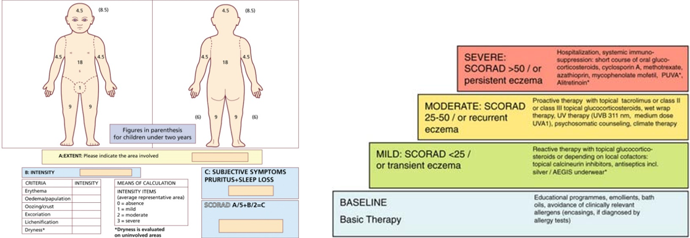
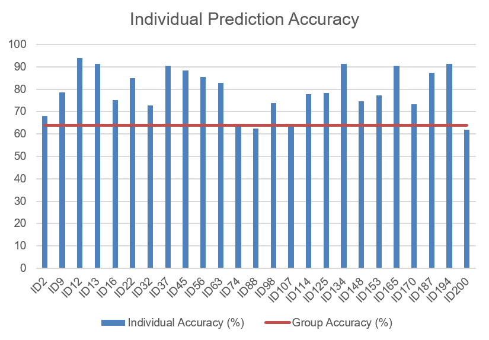

## Senviron <br/>
<p align="right">
<b>A Prototype of Multimodal Atopic Dermatitis Precaution System</b>
</p>

### Background <br/>
Atopic Dermatitis (AD) is a chronic skin disease directly caused by dysfunction of skin barrier(Stratum Corneum). Being well-known as a prevalent disease among children, AD is a global issue of reducing the quality of lives of both children and their parents. In Singapore, about 20% school-going children are suffering from AD.(1)
<p align="center"> 
  
</p>
The most common soothing method is to apply lotion.<br/>
<b>However the issue is when to apply lotion and here comes the aim of my project<b/><br/>

### Aim and Detail <br/>
What I inted to do is to make predictions about the outbreak of Atopic Dermatitis, so the patients could apply lotion before things go bad.<br/>
Dysfunction of skin barrier has not been fully understood but there are factors that contribute to it. Environment, mental stress and genome are three different but interwined factors.(2,3,4,5) In this project, I use enviroment conditions (temperature, relative humidity, particle matters etc.) as the input feature to build a SVM model and mental stress based on ECG signal will be included in the future.<br/>

Moreover, the application is redesigned with more functions like query local weather condition through [API](https://www.airvisual.com/api) and better user-interface.

### Hardware Setup <br/>
Controller Board: [Bluno Beetle](https://www.dfrobot.com/product-1259.html) (MCU: ATmega328P, BLE: TI CC2540)<br/>
Sensor: [Plantower PMS5003](https://www.dfrobot.com/product-1612.html)<br/>

Arduino Code 

```C
char col;
unsigned int PMSa = 0,FMHDSa = 0,TPSa = 0,HDSa = 0,PMSb = 0,FMHDSb = 0,TPSb = 0,HDSb = 0;
unsigned int PMS = 0,FMHDS = 0,TPS = 0,HDS = 0,CR1 = 0,CR2 = 0;
unsigned char buffer_RTT[40]={};   //Serial buffer; Received Data
char tempStr[15];
void setup() 
{
  Serial.begin(115200);
  Serial1.begin(9600);
}

void loop() 
{
  while(!Serial1.available());
  while(Serial1.available()>0)   //Data check: weather there is any Data in Serial1
  {
    for(int i=0;i<40;i++)
    {
      col =Serial1.read();
      buffer_RTT[i]=(char)col;
      delay(2);
    }

    Serial1.flush();

    CR1 =(buffer_RTT[38]<<8) + buffer_RTT[39];
    CR2 = 0;
    for(int i=0;i<38;i++)
      CR2 += buffer_RTT[i];
    if(CR1 == CR2)                //Check
    {
      PMSa=buffer_RTT[12];         //Read PM2.5 High 8-bit
      PMSb=buffer_RTT[13];         //Read PM2.5 Low 8-bit
      PMS=(PMSa<<8)+PMSb;          //PM2.5 value
      TPSa=buffer_RTT[30];          //Read Temperature High 8-bit
      TPSb=buffer_RTT[31];          //Read Temperature Low 8-bit
      TPS=(TPSa<<8)+TPSb;        //Temperature value
      HDSa=buffer_RTT[32];          //Read Humidity High 8-bit
      HDSb=buffer_RTT[33];          //Read Humidity Low 8-bit
      HDS=(HDSa<<8)+HDSb;      //Humidity value
    }
    else
    {
      PMS = 0;
      FMHDS = 0;
      TPS = 0;
      HDS = 0;
    }
  }

  Serial.print("Temp : ");
  sprintf(tempStr,"%d%d.%d",TPS/100,(TPS/10)%10,TPS%10);
  Serial.print(tempStr);  
  Serial.println("C");               //Serial pring Temperature
  Serial.print("RH   : "); 
  sprintf(tempStr,"%d%d.%d",HDS/100,(HDS/10)%10,HDS%10);              
  Serial.print(tempStr);            //Serial print humidity
  Serial.println(" %");               //"%"
  Serial.print("PM2.5: ");
  Serial.print(PMS);            
  Serial.println(" ug/m3");       // Serial print PM2.5, unit: ug/m³
  Serial.println(); 
}
```
### APP on Android Platform <br/>
UI and functions are shown below.
 <br/>
### SVM Model 
#### Dataset <br/>
177 AD patients under 6 years old from the Seoul Metropolitan Area in Korea were enrolled and followed for 17 months between August 2013 and December 2014. [Dataset](https://zenodo.org/record/56248#.W1DKJ9IzaUk)<br/>
#### Features and Classification Criteria<br/>
Features: PM10, NO2, O3, temperature, relative humidity

Classification: SCORAD(Scoring Atopic Dermatitis)
<br/>
#### Results<br/>
Testing Method: 7-fold cross validation<br/>
Results include group training/testing and individual training/testing<br/>
<br/>

### Task List

### Reference
[(1)British Journal of Dermatology 2002, 146,1, 101](https://onlinelibrary.wiley.com/doi/abs/10.1046/j.1365-2133.2002.04566.x)<br/>
[(2)Pediatrics  2014, 134, 6, e1735](http://pediatrics.aappublications.org/content/134/6/e1735.long)<br/>
[(3)Sci. Transl. Med. 2014, 6, 244, 244ra90](http://stm.sciencemag.org/content/6/244/244ra90)<br/>
[(4)Curr. Allergy. Asthma. Rep.  2008, 8 ,4 312](https://www.ncbi.nlm.nih.gov/pubmed/18606083)<br/>
[(5)J. Investig. Dermatol.  2009, 129, 8, 1892](https://www.jidonline.org/article/S0022-202X(15)34442-0/fulltext)
